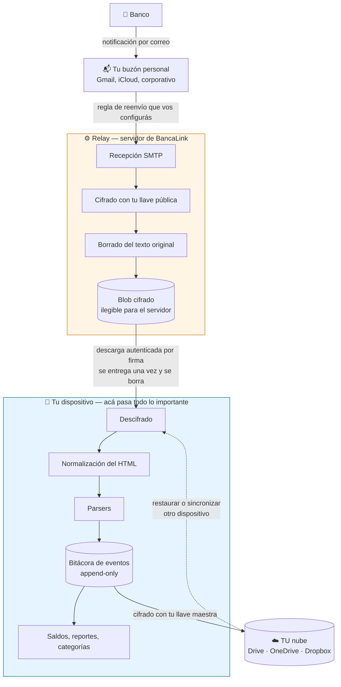

# Flujo de un correo, de punta a punta

Este es el recorrido completo de una transacción: desde que el banco manda la notificación hasta que aparece como un gasto en tu app y queda respaldada.

Si vas a leer un solo diagrama de este proyecto, que sea este.

## Lo que hay que entender de este dibujo

**El relay recibe pero no comprende.** Cifra apenas recibe, borra el original y nunca interpreta el contenido. No sabe de qué banco es, ni de cuánto fue el movimiento. Los límites exactos de esa afirmación están en [`02-limites-de-confianza.md`](02-limites-de-confianza.md) — vale leerlo, porque hay matices.

**Nunca pedimos acceso a tu buzón.** Vos configurás una regla de reenvío y la borrás cuando querás. Esa fue una decisión deliberada: OAuth de Gmail arrastraba auditorías CASA que habrían hecho el proyecto inviable (D3).

**Todo lo que requiere entender tus datos ocurre en tu dispositivo.** Descifrado, parsing, categorías, reportes. El servidor no participa.

**La nube es almacenamiento tonto.** El respaldo va cifrado con tu llave maestra, en la carpeta de aplicación del proveedor. Google puede leer esa carpeta; lo que encuentra es ruido (D8).

## Qué pasa si algo falla

| Falla | Qué ocurre |
|---|---|
| Relay caído o sin red | La app funciona completa con datos locales. Solo se atrasan los correos nuevos |
| Blob de nube corrupto | Nunca se sobrescribe el respaldo a ciegas ni se toca lo local. Se avisa y se preserva |
| Correo duplicado | Produce el mismo ID determinista y se descarta al fusionar (D10) |

---

**Decisiones relacionadas:** D2 (relay ciego), D3 (ingesta por reenvío), D8 (respaldos en tu nube), D10 (bitácora de eventos), D15 (sin cuentas).
