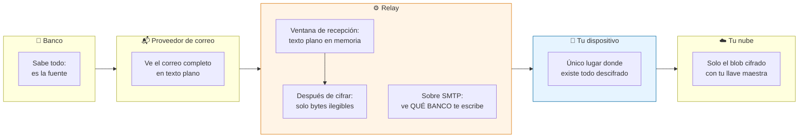
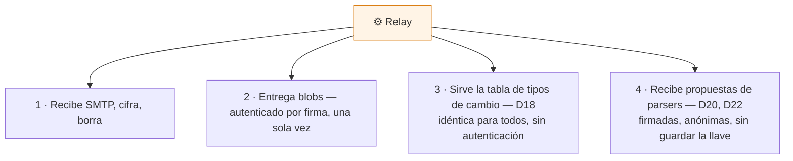

# Límites de confianza — qué ve cada quien

El argumento central de BancaLink es *"no confiés en nosotros, revisá el código"*. Ese argumento se cae si exageramos lo que la arquitectura garantiza. Este diagrama existe para ser preciso, incluidos los matices incómodos.

## La tabla honesta

| Quién | Contenido del correo | Qué banco te escribe | Tu historial completo |
|---|---|---|---|
| Banco | ✅ todo | ✅ | ❌ |
| Proveedor de correo | ✅ todo | ✅ | ❌ |
| **Relay** | ⚠️ **solo en el instante de recepción** | ⚠️ **sí** | ❌ nunca |
| Tu nube | ❌ cifrado | ❌ | ⚠️ cifrado, ilegible |
| **Tu dispositivo** | ✅ | ✅ | ✅ |

## Los dos asteriscos, explicados

### 1. Existe una ventana de texto plano en el relay

El banco manda SMTP sin cifrar. **No hay diseño que evite eso**: el remitente es el banco y no va a cifrar hacia tu llave. Así que el correo llega en claro y hay un instante —el que toma cifrarlo— en que el proceso del relay lo tiene en memoria.

Lo que hacemos con esa ventana:

- Cifrar de inmediato y borrar el original.
- **Nunca interpretar.** El relay no parsea: parsear exigiría texto plano y activaría las obligaciones completas de la Ley 8968 sobre datos financieros, además de convertir al servidor en un blanco valioso.
- Publicar el código bajo AGPL, para que cualquiera verifique que eso es lo que hace.
- Permitir que lo hospedes vos, que es lo único que cierra la ventana del todo.

Por eso decimos **"el servidor recibe, pero no entiende"** y no *"el servidor nunca puede ver nada"*. La segunda frase sería falsa.

### 2. El relay ve qué bancos te escriben

El sobre SMTP lleva el `MAIL FROM` en claro. Aunque el contenido quede cifrado, el relay ve que a tu dirección le llega correo de `baccredomatic.cr`.

No se puede evitar sin un rediseño mayor de la ingesta. Está documentado acá porque callarlo sería exactamente el tipo de omisión que este proyecto no se puede permitir.

## Qué hace el relay, en realidad

La etiqueta "relay ciego" ya no describe todo. Hace cuatro cosas:

Cada una se defiende sola, y ninguna requiere entender un correo. Las tres últimas se diseñaron para no revelar nada de vos: la tabla de tipos de cambio se pide completa —nunca "convertime colones a dólares"— y el índice de parsers también, porque pedir el de un banco delataría dónde tenés cuenta.

---

**Decisiones relacionadas:** D2, D3, D12 (cero telemetría), D18 (tipo de cambio), D20 y D22 (contribución de parsers).
