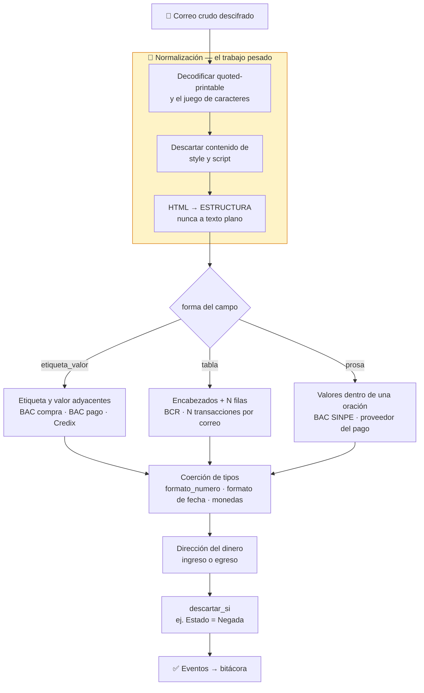
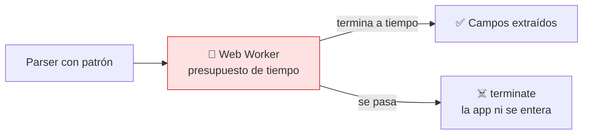

# Pipeline de parsing

Acá está la complejidad real del proyecto, y no donde uno esperaría. Todo este diseño salió de mirar **seis correos reales** (BAC compra en colones y en dólares, BAC SINPE, BAC pago de servicios, BCR tarjetas, Credix), no de anticipar.



## Por qué la normalización es lo más difícil

**Ninguna de las seis muestras trae `text/plain`.** Todas son `text/html` con `quoted-printable`.

Y esa codificación **parte palabras a la mitad**. Esto es real, del correo del BAC:

```
Tipo d=
e Transacci=C3=B3n:
```

Eso es `Tipo de Transacción:` cortado dentro de la palabra "de". Sobre los bytes crudos **no funciona ni un regex ni una búsqueda literal**. Ninguna de las dos.

**HTML a estructura, jamás a texto plano.** El BCR entrega los datos en una `<table>` donde el valor se liga a su encabezado **por posición de columna**. Aplanar eso a texto destruye la correspondencia y no se recupera:

```
Fecha  Autorización  Referencia  Monto  Moneda  Comercio  Estado
```
```
19/08/2025  00000000  523164786761  15.00  US DOLLAR  PADDLE NET  Negada
```

Aplanado quedan catorce palabras en fila sin saber cuál va con cuál.

## Las tres formas se mezclan

Un correo puede necesitar más de una. El comprobante de pago de servicios del BAC es etiqueta-valor en casi todo:

```
Monto:                  13,333.00 CRC
Fecha de Pago:          2026-08-16 15:10:16.058
Número de Autorización: 951537004
```

…salvo el proveedor, que es el campo más importante y solo existe dentro de una oración:

> Se ha realizado un pago de servicio de **JASEC** desde **Banca Móvil**.

Por eso `forma` se declara **por campo**, con un valor por defecto en el parser.

## Las trampas que encontramos mirando correos

| Trampa | Evidencia | Consecuencia si se ignora |
|---|---|---|
| **Separador decimal** | BAC `1,190.00` · Credix `10500,00` | Error silencioso de ×100 o ×1000 |
| **Dirección del dinero** | SINPE recibido es ingreso | Se suma donde debía restar |
| **Transacción rechazada** | BCR `Estado: Negada` | Se inventa un gasto que nunca ocurrió |
| **Remitente múltiple** | BAC usa `.cr` **y** `.com` | El parser nunca corre, sin dar error |
| **Moneda en 5 vocabularios** | `CRC` `USD` `US DOLLAR` `COLONES` `Colones` | No se reconoce la moneda |
| **Etiqueta variable** | `MASTER:` vs `VISA:` | El campo no se encuentra |
| **Dos fechas por correo** | `2026-08-16 15:10:16.058` y `20260825` | El formato no puede ser por parser |

El gasto fantasma es el peor de todos. Una transacción faltante se corrige sola cuando confirmás un saldo real (D17); una inventada te descuadra activamente.

## Motor y seguridad

Las formas `etiqueta_valor` y `tabla` se resuelven **sin regex**. La `prosa` no, y los SINPE son de lo más común del país — así que el regex no es un caso marginal.



**Por qué un Worker y no un timeout:** en JavaScript **una expresión regular no se puede interrumpir**. Es síncrona y no cede el hilo. La única forma real de cortarla es que corra en un proceso que se pueda matar.

Además el dialecto se restringe al subconjunto compatible con RE2 desde el primer parser: sin retrolectura, sin retro-referencias. No cuesta nada hoy y es lo único que se pierde para siempre si se posterga — el motor se cambia cuando se quiera, pero cuarenta parsers ya escritos no se migran.

---

**Ver también:** §6 del [diseño de arquitectura](../superpowers/specs/2026-08-26-arquitectura-tecnica-design.md) · D7, D17, D23.
