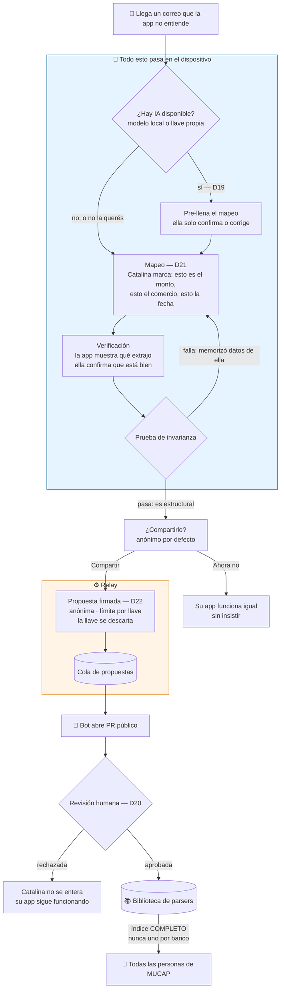

# Ciclo de vida de un parser

Qué pasa cuando tu banco cambia el formato de sus correos y la app deja de entenderlos. Este recorrido cruza cinco decisiones (D19 a D23) y es difícil de reconstruir leyéndolas sueltas.

El caso que guía el diseño: **doña Catalina tiene cuenta en MUCAP, no existe parser para MUCAP, y no va a abrir una cuenta de GitHub.**

## Las cinco ideas que sostienen esto

**1. El camino principal no usa IA.** Catalina marca los campos con el dedo y la app deduce la regla. Sin llave de API, sin bajar un modelo de varios gigas a un teléfono de gama media, sin que el correo salga del dispositivo. La IA solo **adelanta** el trabajo cuando está disponible; la app nunca se queda esperándola (D21).

**2. Quien valida es ella, no el modelo.** Catalina tiene la verdad en la mano: sabe que ese correo era una compra de ₡45.200 en el AutoMercado. Por eso la calidad del generador importa menos de lo que parece.

**3. La prueba de invarianza reemplaza la detección de datos personales.** En vez de buscar datos de Catalina para borrarlos —lista negra, siempre deja pasar alguno— se aprovecha que **un parser bueno debe funcionar igual con otros valores**:

```mermaid
flowchart LR
    O["Correo de Catalina"] --> M["Copia con TODOS<br/>los valores cambiados"]
    M --> T{"¿El parser<br/>extrae bien?"}
    T -->|sí| E["✅ Es estructural<br/>se puede compartir"]
    T -->|no| N["❌ Memorizó sus datos<br/>NO sale del dispositivo"]
```

Determinista, sin falsos negativos silenciosos. De yapa, atrapa parsers frágiles.

**4. Anónima de verdad, y con freno al spam.** El relay ya sabe autenticar por firma sin conocer identidad (D15), así que la propuesta viaja firmada pero anónima, con límite por llave pública. **La llave se descarta después de validar**: si quedara guardada junto a la propuesta, la cola misma sería el vínculo que el anonimato promete que no existe.

**5. El PR es público a propósito.** No es un detalle de flujo: cada arreglo deja un registro fechado y verificable de que la falta de un estándar de banca abierta le cuesta plata y tiempo a la gente. Esa evidencia es el objetivo 2 del proyecto. Si los aportes murieran en una cola privada, se perdería justo cuando más volumen tendría.

## Dos puertas, cada una para su público

| | Dentro de la app | GitHub |
|---|---|---|
| Para quién | Catalina, que no sabe qué es GitHub | Quien quiere crédito por su aporte |
| Identidad | Anónima siempre | Pública |
| Firma DCO | No aplica — un parser es dato, no código (D22) | — |

## Lo que se cede con el anonimato

Si la propuesta se rechaza, **Catalina no se entera**: no hay canal de vuelta. Pero su app sigue funcionando con la regla que ella hizo, así que no queda peor que antes. El aporte era altruista.

Y cuando llegue el parser oficial de MUCAP, **el de ella no se toca**: lo local se conserva mientras funcione. Si algún día falla, ahí se intenta el oficial. Sin preguntas ni pantallas de elección — Catalina no tiene por qué saber que existen dos.

---

**Decisiones relacionadas:** D6, D7, D19, D20, D21, D22, D23 · [diseño de contribución anónima](../superpowers/specs/2026-08-26-contribucion-anonima-parsers-design.md).
