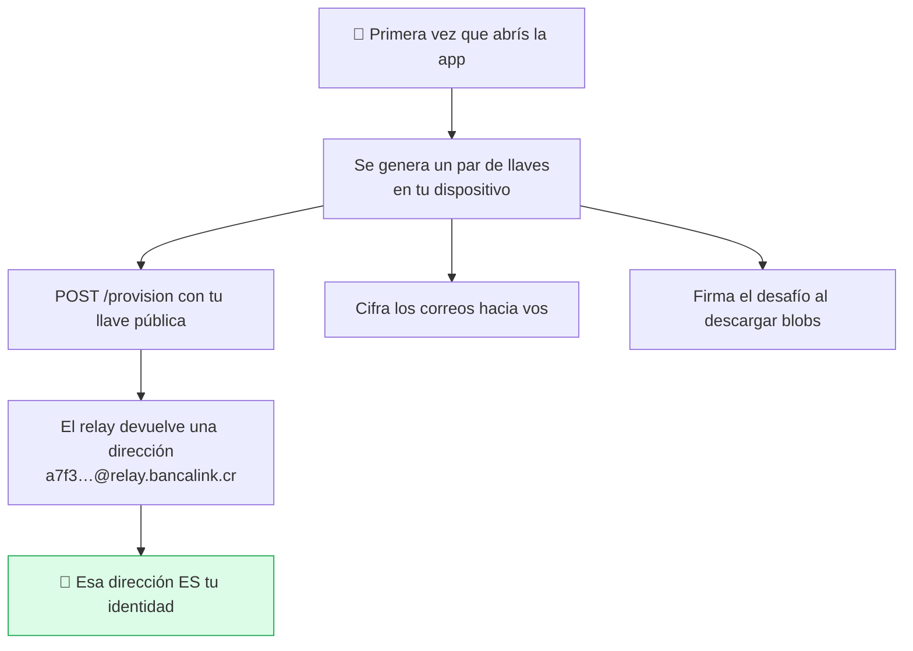
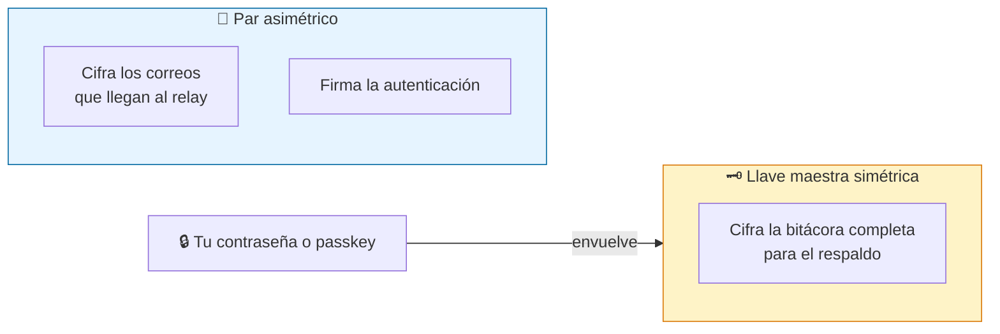
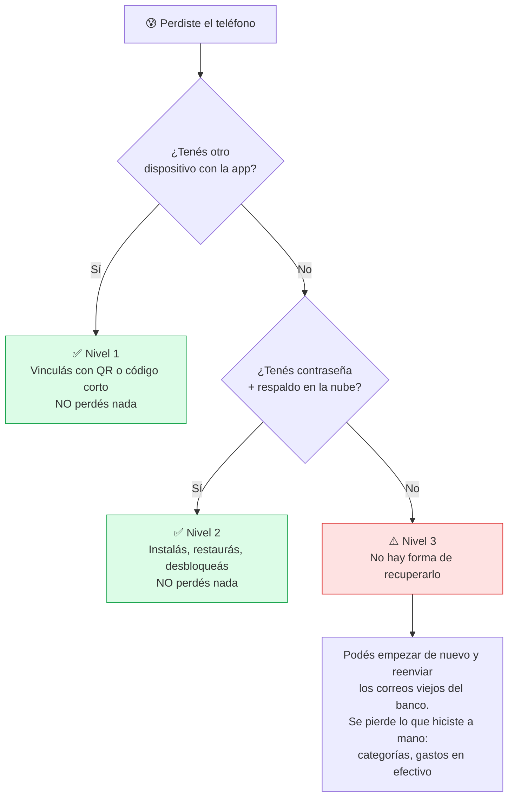

# Identidad, llaves y recuperación

BancaLink no te pide correo, ni contraseña, ni nombre, ni cédula. Eso tiene una consecuencia que hay que decir de frente y no en letra chica: **si perdés tus llaves y no dejaste método de recuperación, nadie puede devolverte tu historial.** Ni nosotros.

## Cómo nace tu identidad

El relay solo guarda `dirección aleatoria ↔ llave pública`. No hay nombre, ni correo, ni nada que te identifique.

**Por qué se firma para descargar.** Como el relay entrega cada blob una sola vez y después lo borra, alguien que descubriera una dirección ajena podría provocarle pérdida de transacciones —aunque nunca pudiera leer su contenido. Por eso exige firma válida antes de entregar o borrar nada.

## Las dos llaves y sus papeles

**La envoltura importa.** Cambiar la contraseña solo re-envuelve la llave maestra; **no re-cifra tu historial**. En una app local-first, re-cifrar todo significaría reescribir la base entera en cada dispositivo — lento y con riesgo de fallar a medias.

## Si perdés el dispositivo

**Reinstalar o borrar los datos en el mismo dispositivo cuenta como "no tengo otro dispositivo"** y cae directo al Nivel 2.

**El Nivel 3 es la consecuencia directa e innegociable del conocimiento cero:** nadie, en ningún lado, tiene una copia legible de tu llave. Por eso el onboarding tiene que empujar activamente a configurar al menos un método real de recuperación — si no, el Nivel 3 deja de ser la excepción y se vuelve lo normal.

## Dónde vive cada secreto

Un detalle que parece menor y no lo es: **los secretos no van en la bitácora de eventos.**

| | Bitácora de eventos | Almacén de secretos |
|---|---|---|
| Estructura | Append-only | Mutable, borrado real |
| Cifrado | Llave maestra | Llave maestra |
| ¿Entra al respaldo? | Sí | **No** — opt-in explícito |
| ¿Se fusiona entre dispositivos? | Sí | No |

**Por qué es obligatorio y no una preferencia:** la bitácora es *append-only*, así que **lo que entra ahí no se puede borrar nunca**. Una llave de API guardada como evento sería irrevocable: "revocada" sería apenas un evento posterior, con el valor original intacto en el historial, copiado a cada dispositivo y a cada respaldo (D19).

---

**Decisiones relacionadas:** D9 (passkeys), D10 (bitácora), D15 (sin registro), D16 (recuperación), D19 (llave de IA).
