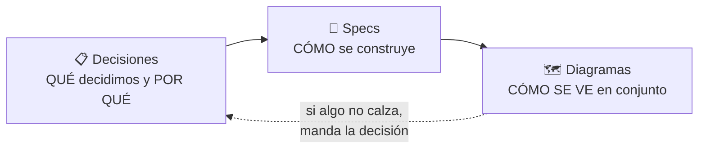

# Diagramas de arquitectura

Diagramas en [Mermaid](https://mermaid.js.org/), embebidos en Markdown para que GitHub los renderice solo. Se editan como texto, así que los cambios se revisan en un PR como cualquier otro archivo.

**Si venés llegando al proyecto, leelos en este orden.**

| # | Diagrama | Qué responde |
|---|---|---|
| 1 | [Flujo de un correo](01-flujo-de-un-correo.md) | ¿Cómo llega una transacción del banco a mi app? |
| 2 | [Límites de confianza](02-limites-de-confianza.md) | ¿Qué ve el servidor y qué no? ¿Dónde están los asteriscos? |
| 3 | [Pipeline de parsing](03-pipeline-de-parsing.md) | ¿Cómo se convierte un correo HTML en una transacción? |
| 4 | [Ciclo de vida de un parser](04-ciclo-de-vida-de-un-parser.md) | ¿Qué pasa cuando el banco cambia el formato? |
| 5 | [Identidad y recuperación](05-identidad-y-recuperacion.md) | ¿Cómo funciona sin cuentas? ¿Y si pierdo el teléfono? |

Si solo vas a leer uno, que sea el **1**. Si te interesa la parte que hace este proyecto distinto de los demás, leé el **2**.

## Cómo se relacionan con el resto de la documentación

- [`BancaLink_Decisiones.md`](../BancaLink_Decisiones.md) — el registro de decisiones (D1–D23). **Es la fuente de verdad.**
- [`specs/`](../superpowers/specs/) — los diseños técnicos detallados.
- Esta carpeta — la vista de conjunto.

Los diagramas **no deciden nada**. Si un diagrama contradice una decisión, el diagrama está desactualizado.

## Al modificar un diagrama

1. Referenciá la decisión (`D18`, `D21`) en vez de repetir su razonamiento. Si el razonamiento cambia, se cambia en un solo lugar.
2. **No exageres las garantías.** El diagrama 2 existe justamente para ser preciso sobre lo que la arquitectura *no* garantiza. Un diagrama que promete de más es peor que no tenerlo.
3. Verificá que renderice — GitHub muestra un error en vez del diagrama si la sintaxis está mal.

## Todavía no existen

Se van a agregar cuando el diseño esté cerrado:

- **Bitácora de eventos y sincronización** — cómo se fusionan dos dispositivos sin conflictos (D10).
- **Modelo de datos** — entidades y relaciones (§4 del spec).
- **Despliegue** — qué corre dónde, contenedores, y cómo auto-hospedarlo.
