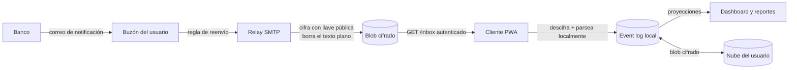

# BancaLink — Diseño de arquitectura técnica (v1)

**Fecha:** 26 de agosto de 2026
**Estado:** Diseño aprobado. Siguiente paso: plan de implementación.

Este documento describe **cómo** se construye BancaLink. Es el complemento técnico de [`docs/BancaLink_Decisiones.md`](../../BancaLink_Decisiones.md), que registra el **por qué** de las decisiones de dirección (D1–D14). Cuando aquí se cita "D7" o "D10", se refiere a ese documento.

---

## 1. Contexto

BancaLink convierte las notificaciones que los bancos costarricenses envían por correo en un registro de gastos e ingresos, sin que el proyecto pueda leer jamás el contenido de esos correos ni de las transacciones del usuario.

Las restricciones que dan forma a todo lo demás:

- **Conocimiento cero (D2):** el servidor recibe correo, pero nunca puede interpretarlo.
- **Local-first (D2):** los datos financieros viven en el dispositivo de la persona.
- **Gratis y auto-hospedable (D1, AGPLv3):** ningún costo operativo puede trasladarse al usuario ni al que auto-hospeda.
- **Para público general, no para informáticos (D4):** si una decisión técnica exige que el usuario entienda contenedores o terminal, se descarta.
- **Cero telemetría (D12):** no se recolecta absolutamente nada del uso.

Una restricción adicional, propia del equipo: **la implementación la ejecuta un modelo de IA guiado por specs.** Eso favorece stacks convencionales, ampliamente documentados y con poca "magia" — no por moda, sino porque reduce la ambigüedad de lo que hay que construir.

---

## 2. Arquitectura general

Monorepo, todo en TypeScript:

| Paquete | Responsabilidad |
|---|---|
| `apps/client` | PWA instalable. Toda la lógica de negocio, el cifrado y los datos. React + TypeScript + Vite + `vite-plugin-pwa`. |
| `apps/relay` | Servidor ciego. Recibe correo por SMTP, cifra, sirve una vez, borra. Node.js + TypeScript + `smtp-server`, en Docker sobre un VPS propio. |
| `packages/parsers` | Motor declarativo que interpreta las reglas YAML de cada banco. Lo usa solo el cliente. |
| `packages/shared` | Tipos del esquema de eventos, utilidades de cifrado, formato de parser. Fuente única de verdad. |

**Por qué SMTP propio y no un proveedor SaaS de correo entrante** (Mailgun, Postmark): mantiene todo el stack en un lenguaje, hace que el auto-hospedaje sea el mismo contenedor Docker que corre en producción (Opción D de D2, sin código aparte), y evita atarse a un proveedor que cobra por volumen — coherente con asumir la infraestructura de forma personal.

### Flujo de datos extremo a extremo



1. El usuario configura una regla de reenvío en su propio correo hacia su dirección dedicada.
2. El relay recibe el correo, lo cifra con la llave pública del usuario, guarda el blob y **borra el texto plano de inmediato**.
3. El cliente descarga los blobs pendientes, los descifra en el dispositivo, corre los parsers y emite eventos al log local.
4. El estado (saldos, reportes) se materializa reduciendo el log; nada se persiste como "estado calculado".
5. El log cifrado se sincroniza contra la nube que el usuario elija (D8).

El relay **nunca** parsea. Es deliberado: parsear requeriría texto plano, lo que activaría las obligaciones completas de la Ley 8968 sobre datos financieros y convertiría al servidor en un objetivo de ataque valioso.

---

## 3. Identidad, dispositivos y recuperación

### Aprovisionamiento sin cuenta

No hay registro. No se pide correo, contraseña, nombre ni cédula.

En el primer arranque el cliente genera localmente un par de llaves y pide al relay una dirección dedicada:

```
POST /provision  { llavePublica }  →  { direccion: "a7f3...@relay.bancalink.cr" }
```

El relay solo almacena `dirección aleatoria ↔ llave pública`. **La dirección dedicada es la identidad.**

Ese mismo par de llaves cumple dos funciones: cifrar el contenido de los correos, y **firmar el desafío de autenticación** al descargar blobs. Esto último resuelve un riesgo real que la arquitectura sin cuentas introduce: como el relay sirve cada blob una sola vez y luego lo borra (D2), alguien que descubriera una dirección ajena podría provocar pérdida de transacciones aunque nunca pudiera leer su contenido. El relay exige una firma válida contra la llave pública registrada antes de servir o borrar nada.

`POST /provision` se limita por IP — anti-abuso de generación masiva de direcciones, no protección de identidad (no hay identidad que proteger en ese punto).

### Multiplicidad de identidades

Sin cuenta central, nada impide que una persona termine con varias identidades independientes. Hay que distinguir dos casos:

- **Intencional** (perfiles separados: personal vs. negocio, o cada miembro de una familia). Está bien, es una consecuencia natural del modelo.
- **Accidental** (instalar en un segundo dispositivo sin saber que hay que emparejar, fragmentando el historial). Se previene por **onboarding, no por backend**: el primer arranque nunca genera identidad por default. Siempre pregunta primero *"¿es la primera vez, o ya tenés BancaLink en otro dispositivo?"*, con emparejar/restaurar como camino prominente.

### Emparejamiento de dispositivos

Copiar el mismo par de llaves al dispositivo nuevo, por dos vías equivalentes:

- **QR** si los dispositivos están físicamente juntos (rápido).
- **Código corto de un solo uso**, generado por el dispositivo existente y tecleado en el nuevo, si no lo están.

No depende de que el respaldo en la nube esté configurado.

### Árbol de recuperación

| Nivel | Situación | Resultado |
|---|---|---|
| **1** | Hay otro dispositivo con la app (aunque no esté presente ahora) | Emparejar por QR o código. **Sin pérdida.** |
| **2** | No hay otro dispositivo, pero sí contraseña/frase + respaldo en nube (D8) | Instalar → restaurar → conectar nube → descifrar. **Sin pérdida.** |
| **3** | Ni otro dispositivo ni respaldo recuperable | Aprovisionar dirección nueva, reconfigurar reenvío, reenviar correos históricos. **Se pierden las ediciones manuales.** |

**Sobre "no recuerdo con cuál cuenta hice el respaldo":** no existe ningún "email de BancaLink" que olvidar, porque nunca se pidió uno. Lo que sí puede pasar es no recordar en cuál de las propias cuentas de nube quedó el respaldo — y como la carpeta usa el scope `appdata`, está oculta de la interfaz normal de Drive/OneDrive y no se puede buscar a mano. La app debe permitir intentar conectar cada cuenta candidata y avisar en cuál encuentra un respaldo.

**Reinstalar o borrar los datos en el mismo dispositivo** cuenta como "no hay otro dispositivo" → cae directo al Nivel 2.

El Nivel 3 es la consecuencia directa e innegociable del conocimiento cero: nadie, en ningún lado, tiene una copia legible de la llave. Debe comunicarse con claridad en el producto, no aparecer como sorpresa. **Implicación:** el onboarding tiene que empujar activamente a configurar al menos un método real de recuperación; de lo contrario el Nivel 3 se vuelve el caso común en vez de la excepción.

---

## 4. Modelo de datos

Bitácora de eventos append-only (D10). Se distingue entre eventos **core** (con UI y lógica en v1) y **esqueleto** (el tipo existe en `packages/shared` desde el día uno, sin implementar). La razón de definir el esqueleto completo desde el inicio es específica de local-first: cada dispositivo migra su propio esquema, algunos usuarios nunca actualizan, y hay que soportar versiones viejas indefinidamente — equivocarse en el esquema es caro de forma permanente.

### Cuentas

```ts
CuentaCreada {
  id, alias, moneda,
  tipo: "corriente_ahorro" | "tarjeta_credito" | "credito_comercio"
      | "prestamo" | "efectivo" | "deposito_plazo",
  entidadEmisora: string,            // banco, comercio (Gollo, Monge), o "efectivo"

  limiteCredito?:  { valor, moneda }, // tarjetas, crédito de comercio
  tasaInteres?:    number,            // tarjetas, crédito de comercio, préstamos, depósitos
  diaCorte?:       number,            // tarjetas, crédito de comercio
  diaPago?:        number,            // tarjetas, crédito de comercio
  montoOriginal?:  { valor, moneda }, // préstamos, crédito a plazo, depósitos
  plazoMeses?:     number,            // préstamos, crédito a plazo, depósitos
  fechaVencimiento?:     string,      // depósitos a plazo, certificados
  renovacionAutomatica?: boolean      // depósitos a plazo, certificados
}
```

Se eligió el nombre `Cuenta` sobre alternativas más técnicas ("InstrumentoFinanciero") por D4: el vocabulario del modelo debe ser el de la persona, no el del contador.

El crédito de comercio (Gollo, Monge) se modela junto a las tarjetas y préstamos porque comparten la misma forma: algo que se debe, con entidad emisora, tasa y plazo. Los depósitos a plazo y certificados encajan en la misma estructura con el flujo invertido.

**Fuera de este esquema, deliberadamente:** inversión de mercado (acciones, fondos, cripto). Es una forma de dato distinta — se valora por precio de mercado, no por monto + tasa + plazo. Como el sistema es event-sourced, agregar un `tipo` nuevo más adelante no rompe ni migra el historial existente, así que no hay costo por no diseñarlo hoy.

### Transacciones

Un solo tipo para todo origen — correo, entrada manual, efectivo, importación. Lo que cambia es `fuente`:

```ts
TransaccionRegistrada {
  id,            // huella determinística (ver dedup) o UUID si es manual
  cuentaId,      // null válido: efectivo sin cuenta asociada
  monto: { valor, moneda },   // moneda ORIGINAL, nunca convertida al capturar (D11)
  fecha, comercio,
  tipo: "gasto" | "ingreso",

  fuente:
    | { tipo: "email",     bancoId, parserId, parserVersion, huellaCorreo }
    | { tipo: "manual",    metodoPago: "efectivo" | "sinpe" | "otro" }
    | { tipo: "importado", loteId, formato: "csv" | "xlsx" | "pdf", filaOriginal? }
    | { tipo: "ajuste",    motivo?: string },

  cuotaInfo?: { numeroCuota, totalCuotas, montoCuota },  // compras a plazo
  relacionadaCon?: string   // reservado, sin uso en v1
}
```

Otros eventos core: `TransaccionCategorizada { transaccionId, categoriaId, timestamp, origen: "auto"|"manual" }`, `TransaccionEditada`, `TransaccionEliminada`, `TransaccionRestaurada` (siempre evento nuevo, nunca mutación del original) y `CategoriaCreada`.

**Borrar es reversible, y eso obliga a una papelera.** `TransaccionEliminada` saca la transacción de toda proyección —saldos, presupuestos, reportes— pero el evento original permanece en el log. `TransaccionRestaurada` la revive. La proyección resuelve el estado tomando el más reciente por `(ts, dispositivo)`, lo que converge entre dispositivos sin coordinación: ambos ven los mismos eventos y eligen el mismo último.

Dos consecuencias que hay que respetar en la interfaz:

- **Hace falta una vista de movimientos borrados.** Sin ella la restauración es inalcanzable, porque no hay dónde tocar. Es una vista filtrada del log, no un almacén aparte.
- **Es permanente, no se purga a los 30 días.** Purgar sería borrado real y la siguiente fusión lo resucitaría desde el otro dispositivo (ver §5, la fusión no distingue "borrado" de "no visto"). Sale barata: son eventos que ya están.

**Reenviar el correo no restaura nada:** la huella determinística lo deduplica. Es lo correcto —evita que un reenvío accidental duplique gastos— pero convierte a la papelera en el único camino de vuelta.

**Las ediciones se fusionan por campo, no por evento completo.** Si un dispositivo cambia la categoría y otro el comercio, sobreviven ambos cambios; con "último evento gana" se perdería uno en silencio. `TransaccionEditada` ya guarda solo los campos modificados, así que no cuesta nada.

### Deduplicación

El `id` de una transacción es su huella:

- **Origen correo:** hash del `Message-ID`, o del cuerpo normalizado si no existe.
- **Origen importación:** hash de `(cuentaId, fecha, monto, comercio normalizado)`.
- **Origen manual:** UUID.

El mismo correo procesado dos veces (reenviado por error, reintento del relay) produce el mismo `id` y se descarta al fusionar. Lo mismo al reimportar un archivo ya procesado.

**Limitación conocida, fuera de alcance de v1:** esto deduplica *el mismo registro visto dos veces*, pero no vincula la autorización con el cobro cuando el banco envía dos correos distintos por la misma compra, ni identifica de forma confiable que una fila de un estado de cuenta es la misma compra que ya entró por correo — las fechas difieren (autorización vs. contabilización) y el nombre del comercio casi nunca coincide exacto. Es un problema de **enlazado**, no de deduplicación. El campo `relacionadaCon` queda reservado para resolverlo más adelante.

### Etiquetas

```ts
EtiquetaAgregada { transaccionId, etiqueta: string, timestamp }
EtiquetaRemovida { transaccionId, etiqueta: string, timestamp }
```

Las etiquetas **no** son categorías con otro nombre. La categoría es **exclusiva** — una por transacción, porque es la unidad sobre la que se calculan presupuestos y reportes. La etiqueta es **aditiva y transversal** ("vacaciones 2026", "reembolsable", "deducible"). Conflacionarlas haría que una transacción con dos categorías se contara doble en los reportes.

Se modelan como agregar/remover granular en vez de reemplazo de conjunto: si dos dispositivos editan etiquetas sin verse, la unión de eventos converge sola; un reemplazo haría que el último en escribir gane y se pierdan etiquetas — exactamente lo que D10 existe para evitar.

### Importación de estados de cuenta

```ts
ImportacionRegistrada { loteId, nombreArchivo, cuentaId, fecha, cantidadFilas }
ImportacionRevertida  { loteId, timestamp }
```

Existen como lote por una razón práctica: importar el archivo equivocado con 200 filas debe poder deshacerse de una vez, no borrando 200 transacciones a mano.

Dado el problema de enlazado descrito arriba, **la importación produce candidatos que el usuario revisa y confirma**, marcando posibles duplicados — nunca fusión automática.

**CSV y XLSX en v1; PDF después.** Los estados de cuenta en PDF varían mucho entre bancos y son frágiles de parsear; encajan naturalmente en el camino de IA con clave propia (D6), que es el mismo patrón de "formato desconocido, generá la regla una vez".

### Saldos y discrepancias

```ts
SaldoReportado { cuentaId, saldo: { valor, moneda }, fecha,
                 fuente: "manual" | "importado" | "email" }
```

Hasta aquí el modelo solo tenía transacciones, y el saldo sería su suma. Pero eso solo es correcto si el conjunto de transacciones está completo, y **estructuralmente nunca lo está**: el correo no cubre efectivo, ni todos los SINPE, ni comisiones, ni la suscripción que rebajó sin notificar. La discrepancia entre lo que la app cree y lo que el banco dice no es un bug — es la condición normal del sistema, y el modelo tiene que representarla.

**Por qué un saldo no puede ser una transacción:** una transacción es un *delta* ("se movieron ₡5.000"); un saldo es una *afirmación de estado* ("el 30 de agosto había ₡88.000"). Meterlos en el mismo tipo destruye la capacidad de comparar lo que la app cree contra lo que realmente es, que es justamente lo que hace posible la reconciliación.

La discrepancia **no se guarda**: es una proyección, `saldo proyectado a esa fecha − saldo reportado`. Se resuelve con una transacción de `fuente: { tipo: "ajuste" }`.

Dos consecuencias del modelo, ambas deseables:

- **El saldo inicial deja de ser un caso especial.** No hace falta `saldoInicial` en `CuentaCreada`: abrir una cuenta es un `SaldoReportado` en su fecha de apertura. Un solo mecanismo para "de dónde arranco".
- **La app se auto-corrige.** El saldo se proyecta desde el `SaldoReportado` más reciente hacia adelante, no sumando desde el principio de los tiempos. Un gasto en efectivo nunca registrado en marzo deja de contaminar el saldo de agosto en cuanto se confirma un saldo real más nuevo. Sin esto los errores se acumulan indefinidamente, que es el modo de falla clásico por el que la gente abandona las apps de finanzas.

### Eventos esqueleto

```ts
// Ciclo personal (D24) — el ÚNICO de este bloque que se implementa en v1,
// porque las proyecciones de saldo y agrupación dependen de él.
CicloConfigurado =
  | { tipo: "mensual";     diaInicio: number }           // 1 = calendario · 25 = del 25 al 24
  | { tipo: "quincenal";   dias: [number, number] }      // [15, 30] · [1, 16] · lo que la persona use
  | { tipo: "cada-n-dias"; dias: number; ancla: string } // pago cada 14 días; corre entre meses

// Presupuesto recurrente: categoría × ciclo × monto
PresupuestoCreado   { id, categoriaId, ciclo: CicloConfigurado,
                      montoLimite: { valor, moneda },
                      origen: "sugerido" | "manual", vigenteDesde }
PresupuestoAjustado { presupuestoId, montoLimite, timestamp }

// Presupuesto de evento (D24): NO es una entidad nueva — es una etiqueta con meta
MetaEtiquetaCreada  { etiqueta: string, montoMeta: { valor, moneda },
                      desde?: string, hasta?: string }

MetaAhorroCreada
GastoCompartido
```

**Dos tipos de presupuesto, no uno (D24).** El recurrente —"₡200.000 al mes en comida"— es categoría sobre ciclo. El de evento —un viaje, las compras de fin de año— tiene nombre y meta, empieza y termina, y **atraviesa los ciclos** en lugar de competir con ellos.

El de evento no requiere entidad nueva: **es una etiqueta con meta**. Las etiquetas ya son aditivas y transversales, y su ejemplo canónico ya era "vacaciones 2026". Un almuerzo en Guanacaste queda en categoría `Comida` **y** con etiqueta `Viaje Guanacaste`: cuenta una sola vez en el gasto del ciclo, y aparte suma contra la meta del viaje. Que la categoría sea exclusiva y la etiqueta aditiva es exactamente lo que evita el doble conteo.

**El ciclo no puede ser mes calendario horneado.** Quien cobra el 25 vive del 25 al 24, y el pago quincenal es común en Costa Rica sin que los días sean siempre 15 y 30. Imponer el mes calendario le impone a la persona un ritmo ajeno, contra D4. Se implementa en v1 aunque los presupuestos no: las proyecciones de saldo y agrupación lo necesitan, y meterlo después obligaría a tocarlas todas.

"Gastado vs. presupuestado" no es un evento: es una proyección sobre transacciones + categorías + presupuesto vigente. El flujo guiado previsto —*entender los gastos primero, sugerir un presupuesto después, acompañar el ajuste*— calcularía promedio o mediana por categoría sobre el log ya materializado: 100% local, sin IA y sin servidor. Está diseñado pero **diferido fuera de v1**, no descartado.

### Moneda (D11, D18)

Cada transacción guarda valor y moneda originales. La conversión ocurre solo al mostrar reportes, contra una tabla de tipos de cambio cacheada localmente para que los reportes funcionen sin red.

**La fuente es conectable (D18).** Un proveedor se declara como configuración, no como adaptador compilado — mismo criterio que los parsers (D7), por la misma razón: las APIs de tipo de cambio gratuitas cambian condiciones o desaparecen, y eso no debe forzar una release.

```yaml
proveedor: bccr
nombre:    "Indicador oficial del BCCR"
url:       "https://apim.bccr.fi.cr/SDDE/api/Bccr.Ge.SDDE.Publico.Indicadores.API"
requiereLlave: true          # inyectada por entorno en el relay, nunca en el cliente
monedaBase:    CRC
```

**Modelo de obtención:**

- El cliente pide **la tabla completa del día**, nunca un par de monedas específico. Consultar por pares filtraría qué monedas tiene la persona — inaceptable bajo D12. La respuesta es idéntica para todos los clientes y no lleva autenticación (contrasta con el endpoint de blobs, que sí exige firma).
- La API del BCCR exige llave. En la instancia hospedada **el relay la consulta una vez al día con la llave del operador (variable de entorno) y redistribuye la tabla**; la llave nunca llega al cliente, que es código abierto y auto-hospedable. Esto no compromete D2: la tabla es un dato público, sin relación con ningún usuario.
- Quien se auto-hospede configura su propia llave, otro proveedor, o ninguno.
- **Piso sin red:** entrada manual del tipo de cambio, siempre disponible. Nunca se elimina.

**Degradación:** si la tabla falta o está vencida, no se bloquea nada — se muestran los montos en moneda original con la conversión marcada como desactualizada. Mismo criterio que "Relay caído" (§8).

**Tipo de cambio histórico:** las vistas en vivo usan el más reciente. Todo artefacto persistido —reporte guardado, `SaldoReportado`— **almacena el tipo de cambio aplicado** junto al dato. Sin eso, un reporte generado en marzo mostraría cifras distintas en agosto sin que nadie lo modifique.

---

## 5. Cifrado y sincronización

**Dos llaves con roles distintos:**

- El **par asimétrico** del cliente cifra los correos hacia el relay (sealed box / ECDH + AES-GCM) y firma el desafío de autenticación.
- Una **llave simétrica maestra** (AES-256-GCM) cifra el event log completo para el respaldo. Está *envuelta* (key wrapping) por la contraseña o passkey del usuario.

Esa envoltura importa: **cambiar la contraseña solo re-envuelve la llave maestra**, no re-cifra el historial. En local-first, re-cifrar todo significaría reescribir la base entera en cada dispositivo — una operación lenta que puede fallar a medias.

**Respaldo:** event log serializado en JSON, cifrado con la llave maestra, subido al app-folder del proveedor de nube elegido (D8). Se usa el scope `appdata`/`appfolder` de Drive y sus equivalentes, que son scopes no sensibles y **no arrastran las auditorías CASA** que obligaron a descartar OAuth de Gmail. Aun así el blob va cifrado: la carpeta está oculta de la interfaz, pero el proveedor sí puede leer su contenido. Cifrado, la nube es almacenamiento tonto.

v1 sube el log fusionado completo en cada sincronización, sin deltas — YAGNI dado el volumen esperado (miles de eventos al año, no millones).

**Fusión entre dispositivos:** descargar → descifrar → unión de conjuntos descartando IDs duplicados → re-cifrar → subir. Como los IDs son deterministas o UUIDs únicos, la unión siempre converge: no hay conflictos reales que resolver, ni "último en escribir gana", ni intervención del usuario.

### Secretos del usuario (D19)

La llave de API de IA (D6) es el primer secreto que la app custodia y **no puede tratarse como un dato más**.

**Vive fuera del event log — restricción dura, no preferencia.** El log es append-only (D10): lo que entra no sale. Un secreto ahí sería irrevocable, replicado a cada dispositivo y a cada respaldo; "revocado" sería solo un evento posterior con el valor original intacto en el historial. Por eso:

| | Event log | Almacén de secretos |
|---|---|---|
| Estructura | Append-only, IDs deterministas | Mutable, borrado real |
| Store IndexedDB | `events` | `secrets` (separado) |
| Cifrado | Llave maestra | Llave maestra |
| Entra en respaldo D8 | Sí | **No** (opt-in explícito) |
| Participa en la fusión | Sí | No |

**Nunca sale hacia el relay.** No es solo D2: una llave con cobros asociados en manos del operador es un vector de fraude. El cliente llama al proveedor de IA directo.

**Fuera del respaldo por defecto.** La asimetría que lo justifica: perder el historial es catastrófico (de ahí la escalera de D16), perder una llave de API cuesta revocarla y reemitirla. Ante pérdida barata, se prefiere no tener credenciales de cobro replicadas en Drive.

> **Pendiente de verificar antes de construir:** los proveedores de IA suelen bloquear llamadas con origen de navegador (CORS) precisamente para desincentivar llaves en el cliente. Si el mecanismo de excepción no aplica, las alternativas son malas — proxiar por el relay le entregaría el correo en claro *y* la llave. Confirmar antes de comprometerse con el modelo navegador-directo.
>
> Riesgo asumido: cualquier XSS o dependencia comprometida en la PWA puede leer una llave que la PWA sabe descifrar. El patrón de uso de D6 (unas pocas llamadas por instalación) acota la exposición, pero conviene sugerir al usuario una llave con límite de gasto.

---

## 6. Formato de parsers (D7, D23)

> Diseñado contra seis correos reales: BAC compra CRC, BAC compra USD, BAC SINPE, BAC pago de servicios, BCR tarjetas, Credix. Las decisiones de esta sección responden a variaciones observadas, no anticipadas — cada tanda de muestras corrigió algo que la anterior daba por cerrado.

### 6.1 Normalización — la etapa que hace el trabajo

Ninguna muestra trae `text/plain`: todas son `text/html` con `quoted-printable`. La codificación **parte palabras a la mitad** (`Tipo d=\ne Transacci=C3=B3n:`), así que sobre los bytes crudos no funciona ni un regex ni una búsqueda literal. La normalización es obligatoria antes de cualquier extracción.

Etapas, en orden:

1. Decodificar `quoted-printable` y la codificación de caracteres declarada.
2. Descartar el contenido de `<style>` y `<script>` (si no, el CSS entra como si fuera texto).
3. Convertir HTML a **estructura, no a texto plano.** BCR entrega los datos en una `<table>` donde el valor se liga a su encabezado **por posición de columna**; aplanar a texto destruye esa correspondencia irrecuperablemente.
4. Normalizar espacios en blanco dentro de cada nodo.

El intérprete de extracción es simple. **Esta etapa es donde está la complejidad real del paquete.**

### 6.2 Tres formas, no una

| Forma | Muestras | Estructura |
|---|---|---|
| `etiqueta_valor` | BAC compra ×2, BAC pago, Credix | Celdas o nodos adyacentes: etiqueta, luego valor |
| `tabla` | BCR | Encabezados de columna + N filas → **N transacciones por correo** |
| `prosa` | BAC SINPE, BAC pago (proveedor) | Valores embebidos en una oración, sin etiquetas |

`tabla` obliga a que el formato soporte **repetición**: un correo puede producir varias transacciones, cada una con su ID determinista para la deduplicación de D10.

**Las formas no son excluyentes por correo.** El pago de servicios del BAC aparece en dos filas de esta tabla porque es lo uno y lo otro a la vez. Por eso `forma` se declara por campo (§6.3, regla 1) y no por parser.

### 6.3 Capa declarativa con escotilla explícita

Las formas `etiqueta_valor` y `tabla` se resuelven **sin regex** — cubren 4 de las 5 muestras. `prosa` no: los delimitadores chocan con el contenido (`entre: ["un monto de ", ","]` sobre `13,139.74 Colones` devuelve `13`).

Por eso el regex **no es un caso marginal**: los SINPE son de las transacciones más frecuentes del país. Pero se declara en un campo aparte, `patron`, para que se vea de un vistazo cuáles parsers lo usan y la revisión de D20 pueda concentrarse ahí.

```yaml
id: bac-pago-servicios
banco: BAC
version: 1              # revisión de ESTE parser — la biblioteca conserva las anteriores (D25)
formatoMinimo: 1        # esquema mínimo requerido; si la app no llega, se salta el parser entero
coincide:
  desde:  ["alerta@baccredomatic.com",           # BAC usa TRES remitentes
           "notificacion@baccredomatic.cr",      # y DOS dominios (.com y .cr)
           "notificaciones@baccredomatic.cr"]
  asunto: "Notificación de pago"

normalizacion:  html
formato_numero: "1,234.56"                  # declarado, nunca inferido
monedas:        { CRC: CRC, Colones: CRC, USD: USD, Dólares: USD }
direccion:      egreso                      # ingreso | egreso | <campo>

extraccion:
  forma: etiqueta_valor                     # por defecto para este parser
  campos:
    monto:    { despues_de: "Monto:", tipo: monto, moneda_al: final }
    fecha:    { despues_de: "Fecha de Pago:",     formato: "YYYY-MM-DD HH:mm:ss.SSS" }
    vence:    { despues_de: "Fecha Vencimiento:", formato: "YYYYMMDD" }
    comercio: { forma: prosa,                     # ← anula la forma del parser
                entre: ["pago de servicio de ", " desde"] }
```

**Cinco reglas que las muestras impusieron sobre este esquema:**

1. **`forma` se declara por campo, con un valor por defecto en el parser.** El comprobante de pago de servicios es etiqueta-valor en casi todo, pero el proveedor —`JASEC`, el equivalente al comercio y el campo más importante— solo existe dentro de una oración: `pago de servicio de <span>JASEC</span> desde <span>Banca Móvil</span>`. **Un mismo correo mezcla formas**, así que no puede haber una sola por parser.

2. **`desde` acepta varias direcciones.** BAC emite desde `notificacion@`, `notificaciones@` y `alerta@`, **y desde dos dominios distintos** (`.cr` y `.com`). Es una trampa silenciosa: quien escriba `@baccredomatic\.cr` no va a fallar con error, simplemente nunca va a procesar los pagos de servicios.

3. **La posición de la moneda se declara** (`moneda_al: inicio | final`). Dentro del mismo banco conviven `CRC 1,190.00` en las compras y `13,333.00 CRC` en los pagos.

4. **El formato de fecha es por campo, no por parser.** Este correo trae dos a la vez: `2026-08-16 15:10:16.058` y `20260825`.

5. **El parser extrae solo campos del modelo de datos (§4); lo demás se descarta.** Este correo trae `Alias`, `Código Pueblo`, `Número Abonado` y otros del dominio "servicios públicos". No entran: quien clasifica es la persona, con las categorías y etiquetas que ya existen en §4 —"electricidad", "casa Guanacaste", "apartamento"— y la app a lo sumo sugiere.

   *Lo que se cede:* con dos servicios JASEC en propiedades distintas, ambos correos dicen `JASEC` y lo único que los separaba era `Número Abonado`. La app no podrá sugerir la etiqueta correcta; hay que ponerla a mano.

   *Por qué se acepta igual:* **es reversible.** A diferencia del formato numérico o del dialecto de regex —donde equivocarse deja daño permanente— acá el dato sigue llegando en cada correo. Si la sugerencia automática llega a valer la pena, el parser agrega el campo, y el historial viejo se recupera reenviando correos (D9).

**Tres campos que las muestras volvieron obligatorios:**

- **`formato_numero`.** BAC escribe `1,190.00` (coma de miles); Credix escribe `10500,00` (**coma decimal**). Inferirlo por heurística produce errores silenciosos de factor 100 o 1000. Se declara o el parser se rechaza.
- **`direccion`.** Una compra es egreso; un SINPE recibido es ingreso. Sin este campo la app suma donde debía restar.
- **`monedas`.** Cinco muestras, cinco vocabularios: `CRC`, `USD`, `US DOLLAR`, `COLONES`, `Colones`.

**Versiones y compatibilidad (D25).** `version` es la revisión del parser; `formatoMinimo` es el esquema que necesita para correr bien. Si la app no alcanza ese mínimo **descarta el parser entero** — nunca lo ejecuta parcialmente. Ignorar un campo desconocido no es seguro: si el formato 2 introdujo `moneda_al` y una app de formato 1 lo omite, no falla, **invierte el monto en silencio**.

Contrasta deliberadamente con el manejo de eventos desconocidos en la bitácora, que se *guardan sin entender* porque son datos del usuario e irrecuperables. Un parser desconocido se descarta: se vuelve a bajar del índice cuando la app se actualice.

**Etiquetas variables.** BAC rotula la tarjeta con su marca — `MASTER:` en una muestra, `VISA:` en otra. `despues_de` acepta alternativas.

**Descarte de transacciones no efectuadas.** BCR incluye una columna `Estado` cuyo valor era `Negada`. Registrarla inventaría un gasto que nunca ocurrió — peor que una transacción faltante (D17), porque un gasto fantasma descuadra activamente en lugar de corregirse solo. Se declara con `descartar_si: { estado: ["Negada", "Rechazada"] }`.

**Robustez ante basura.** El correo de Credix trae `*|MC:SUBJECT|*`, una etiqueta de Mailchimp sin renderizar. Los correos reales llegan con defectos; el motor los tolera en vez de fallar.

### 6.4 Motor y dialecto (D23)

**Motor: `RegExp` nativo, ejecutado en un Web Worker con presupuesto de tiempo y `terminate()`.**

El razonamiento es una restricción del lenguaje: **en JavaScript un regex no se puede interrumpir.** La ejecución es síncrona y no cede el hilo, así que "timeout por regla" no es implementable dentro del mismo hilo. Matar el Worker sí funciona, aunque esté a media ejecución.

Esto contiene el ReDoS **sin agregar un solo byte al bundle** — relevante para un teléfono de gama media (D4) — y de paso evita que la interfaz se congele mientras se procesan correos. RE2 sobre WebAssembly queda como salida futura, no como costo de entrada: el modelo de amenaza lo permite porque los patrones ya pasan por validación al enviarse y por revisión humana (D20).

**Dialecto: el subconjunto compatible con RE2, desde el primer parser.**

| Prohibido | Motivo |
|---|---|
| `(?=` `(?!` `(?<=` `(?<!` | RE2 no los soporta; usarlos cierra la migración |
| `\1`–`\9`, `\k<...>` | Incompatibles con la garantía de tiempo lineal |
| `(x+)+`, `(x*)*`, `(a\|a)*` | La forma que explota por retroceso |

Permitido: clases, anclas, alternancia, cuantificadores, grupos sin captura y **grupos con nombre** — que RE2 sí soporta y son más legibles para D7 que las referencias numéricas. Las banderas (unicode, sensibilidad a mayúsculas) se declaran en el parser; no se heredan de un default implícito.

Se restringe desde ya porque es **lo único de esta sección que se pierde para siempre si se posterga**: el motor se cambia cuando se quiera, pero cuarenta parsers ya escritos con retrolectura no se migran.

**Las dos protecciones son independientes y hacen falta ambas.** El dialecto no detiene el ReDoS —`(a+)+` no usa ninguna función prohibida— y el Worker no preserva la portabilidad.

**Sin `eval` ni ejecución de código arbitrario.** Los parsers los contribuye la comunidad y deben poder correrse sin auditar cada uno línea por línea.

**Banco piloto: BAC.** Es el único con tres formatos distintos entre las muestras (compra CRC, compra USD, SINPE), así que ejercita dos de las tres formas y la mayoría de los campos nuevos con un solo emisor.

### Distribución y contribución (D20)

Un parser generado con IA por una persona debe llegar a todas las demás que usan ese banco. La IA se gasta una vez por cambio de formato, no una vez por usuario.

**Ciclo:** formato roto detectado → el usuario opta por usar su llave (D6, D19) → parser generado localmente → **el usuario decide si lo propone** → revisión humana (PR, D7) → entra a la biblioteca → se distribuye.

**Descarga sin delatar al usuario.** El cliente sincroniza **el índice completo de parsers**, nunca pide uno por banco. Pedir `parsers/banco-beta.yaml` revelaría dónde tiene cuentas quien consulta — el mismo patrón de fuga que la tabla de tipos de cambio en D18, y la misma solución. La biblioteca entera pesa poco (archivos YAML de decenas de líneas), así que bajarla completa es viable indefinidamente.

**Sin publicación automática.** El parser sale de un correo real y puede quedar sobreajustado con datos de quien lo generó — número de cuenta, nombre, monto embebidos en un patrón. Toda propuesta pasa por la prueba de invarianza (D21, abajo) en el cliente, y por revisión humana antes de entrar a la biblioteca.

**Contribuir es un acto público.** Un PR liga la identidad de GitHub de quien contribuye con el banco donde tiene cuentas. Consentimiento explícito, y una vía de envío anónimo para quien no lo quiera.

### Generación de parsers (D21)

**El mecanismo es el mapeador manual; la IA es un acelerador opcional.** El usuario selecciona campos sobre el correo renderizado y el cliente deriva el patrón. 100% local: sin llave, sin modelo descargado, sin red, sin de-identificación (nada sale del dispositivo), sin superficie legal nueva.

```
correo que falla
      ↓
[ mapeo ]  manual (siempre disponible)  ·  pre-llenado por IA (opcional)
      ↓                                       ├── modelo local, si el dispositivo aguanta
      ↓                                       └── llave propia del usuario (D6/D19)
[ verificación ]  el usuario confirma los campos extraídos de SU correo
      ↓
[ prueba de invarianza ]  ← compuerta automática
      ↓
[ propuesta ]  opt-in, con vía anónima (D20)
```

**Prueba de invarianza — la compuerta que reemplaza la detección de PII.** Se muta el correo original sustituyendo todos los valores (cuenta, monto, nombre, fecha) preservando la estructura, y se corre el parser sobre la copia:

- Extrae correctamente los valores nuevos → el parser es estructural. Apto para compartir.
- Falla → memorizó datos del usuario. **No sale del dispositivo.**

Determinista y sin falsos negativos silenciosos, a diferencia de un detector estadístico de entidades. Efecto secundario útil: detecta parsers frágiles, que es un defecto distinto pero igual de indeseable en la biblioteca.

**Dos saneamientos independientes, en momentos distintos:**

| | Cuándo aplica | Qué hace |
|---|---|---|
| De-identificar el correo | Solo si la inferencia es remota | Enmascara valores conservando formato (`4521-8891` → `NNNN-NNNN`) — la IA necesita la forma, no el dato |
| Sanear el parser | **Siempre** | Prueba de invarianza antes de proponer |

**Descartado: generación en el relay.** Requeriría que el relay reciba y comprenda correos bancarios, contradiciendo §2 y D2 — y ni la de-identificación en cliente lo salva, porque si esa limpieza es fiable ya corrió antes de salir del dispositivo, con lo cual el servidor solo aportaría la llamada al modelo. Un asistente en servidor, si llega a existir, será un servicio separado y explícitamente identificado, nunca el relay.

**Nota de esfuerzo:** el riesgo de implementación está en la UI de verificación, no en la generación. Que una persona no técnica pueda confirmar con confianza lo que un parser extrajo es donde D4 se pone exigente.

---

## 7. Manejo de errores

- **Correo sin parser reconocido, o parser que falla:** nunca se descarta ni rompe la app. Va a una cola visible de "correos sin procesar" con el motivo del fallo. Desde ahí se ofrece, opcionalmente, la generación de parser por IA (D6). Esa cola es además evidencia fechada de que un banco cambió su formato — material directo para el objetivo #2.
- **Relay caído o sin red:** la app funciona completa con los datos locales. Solo se retrasan los correos nuevos y la sincronización. Reintentos con backoff; nunca bloquea el uso.
- **Blob de nube corrupto o que no descifra:** nunca sobrescribir el respaldo remoto a ciegas ni tocar el log local. Alertar y preservar intacto lo que hay en el dispositivo.

---

## 8. Dashboard y reportes

Todo es **proyección al vuelo** sobre el event log materializado: no hay eventos nuevos ni estado "reporte" persistido, se recalcula en cada apertura (trivial al volumen esperado).

v1 incluye:

- Resumen del período: ingresos vs. gastos.
- Gasto por categoría en el rango seleccionado.
- Tendencia de los últimos meses.
- Listado de transacciones, filtrable por cuenta, categoría, etiqueta y fecha.
- **Estado de conciliación por cuenta:** saldo proyectado vs. último saldo reportado, con la discrepancia visible.

---

## 9. Exportación y borrado (Ley 8968, derechos ARCO)

La exportación se genera 100% en el cliente desde el log local. **No pasa por el relay** y funciona sin conexión — es el mismo mecanismo que el respaldo a archivo local (D8). Dos formatos, para dos audiencias:

- **CSV** de transacciones, para abrir en Excel o Sheets (D4).
- **JSON del event log completo**, fiel al modelo interno, para migrar toda la historia con su auditoría a otra instalación o a otra herramienta.

**Borrado real de cuenta:** en la instancia hospedada equivale a eliminar la asociación `dirección ↔ llave pública` del relay, con lo cual deja de recibir correo. El relay nunca tuvo datos financieros que borrar. Los datos locales y el respaldo los controla y borra la propia persona.

---

## 10. Estrategia de pruebas

| Ámbito | Enfoque |
|---|---|
| `packages/parsers` | Snapshots con correos sintéticos/anonimizados por formato, en CI. Un cambio de formato que rompa un parser se detecta automáticamente — y es la métrica pública real para el objetivo #2. |
| `apps/relay` | Integración con SMTP de prueba: cifrado → borrado del plaintext → disponibilidad del blob → autenticación por firma. |
| `apps/client` | Unitarios sobre funciones puras: reducer del log, proyecciones y reportes, deduplicación, huella de importación, proyección de discrepancia desde el último `SaldoReportado`. Cifrado/descifrado con vectores conocidos. |
| E2E | Humo: correo sintético → relay → cliente → transacción visible. Sin depender de bancos reales. |

---

## 11. Alcance de v1

**Se construye (UI y lógica):**

- Cuentas tipo `corriente_ahorro` y `efectivo`
- Ingesta por correo reenviado
- Entrada manual (efectivo, SINPE, otros)
- Categorización
- Etiquetas
- Saldos reportados, discrepancias y ajustes
- Importación CSV y XLSX con revisión de candidatos
- Dashboard y reportes
- Exportación CSV y JSON
- Respaldo y sincronización cifrados

**Esqueleto (tipo definido, sin implementar):** tarjetas de crédito · crédito de comercio · préstamos · depósitos a plazo y certificados · presupuestos · metas de ahorro · gastos compartidos · importación PDF · enlazado autorización ↔ cobro · inversión de mercado.

---

## 12. Decisiones sobre PWA y futuro móvil

La app es una PWA instalable (D4) — sin App Store, sin fricción de instalación. Se diseña sin cerrar la puerta a un envoltorio nativo futuro (Capacitor o similar): concretamente, evitando APIs que no funcionen dentro de un WebView nativo. Esto importa sobre todo en la capa de cifrado, donde el soporte de passkeys con extensión PRF difiere entre Safari y `WKWebView`. La contraseña maestra funciona como respaldo universal en cualquier entorno, siguiendo el mismo patrón que usa Bitwarden.
