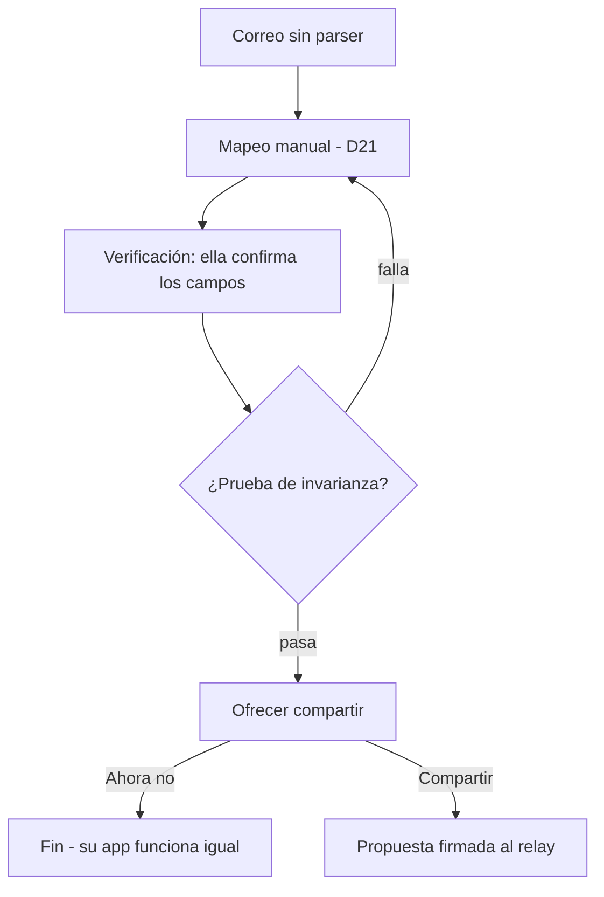

# Contribución anónima de parsers — diseño técnico

**Fecha:** 26 de agosto de 2026
**Estado:** diseño aprobado, sin implementar
**Decisiones relacionadas:** D4, D7, D10, D12, D14, D15, D20, D21

---

## 1. El problema

D20 promete "una vía de envío anónimo para quien no lo quiera" hacer público. Esa vía nunca se diseñó, y sin ella la contribución tiene un requisito implícito de cuenta de GitHub que excluye a la mayoría de las personas para las que se hizo la app (D4).

El caso que motiva este diseño:

> Catalina tiene cuenta en MUCAP. No existe parser para MUCAP. Ella baja la app, reenvía su correo, y usa el mapeador manual de D21 para enseñarle a la app a leerlo. Su app ya funciona. **No tiene cuenta de GitHub y no va a abrir una.**

Conviene separar dos problemas que se confunden:

- **El de Catalina ya está resuelto.** D21 le da un camino completo, local, sin IA y sin cuentas.
- **El que queda abierto es el del bien común:** que su trabajo llegue a las demás personas con cuenta en MUCAP.

Este documento cubre el segundo.

## 2. Alcance

**Incluye:** el flujo de consentimiento en el cliente, el contenido de una propuesta, el transporte autenticado y anónimo hacia el relay, la conversión a PR público, y el manejo de errores.

**No incluye:** el mapeador manual (D21), la prueba de invarianza (D21), la distribución del índice de parsers (D20). Este diseño los consume, no los define.

**Premisa legal (D22, requiere confirmación):** un parser se trata como **dato, no como aporte de código**, y por lo tanto queda exento del DCO que D14 exige. El razonamiento: un parser describe hechos sobre el formato de correo de un tercero ("el monto va después de `Monto:`"), no expresión original. Sin obra que licenciar, no hay firma que recolectar, y la contribución anónima es viable. **Esta premisa sostiene todo el diseño** — si un abogado la descarta, hay que rehacerlo. Se suma a las consultas legales pendientes del registro de decisiones.

## 3. Flujo de Catalina



**Cuándo se ofrece.** Después de que ella confirmó que funciona, nunca antes. Pedirle que apruebe compartir algo cuyo resultado todavía no vio sería pedirle que apruebe a ciegas.

**Qué dice.** Nunca la palabra "parser":

> **Listo, ya entiendo los correos de MUCAP.**
>
> ¿Querés que otras personas con cuenta en MUCAP también puedan usarlos? Compartirías lo que acabás de enseñarle a la app, para que ellas no tengan que hacerlo de nuevo.
>
> **No se comparte nada tuyo:** ni tu nombre, ni tu número de cuenta, ni tus montos. Solo la forma que tienen los correos de MUCAP, y un ejemplo con datos inventados.
>
> `[ Compartir ]` `[ Ahora no ]`

**"Ver qué se comparte" es obligatorio, y no muestra YAML.** D7 estableció que los parsers son "legibles por humanos", pero eso significaba *YAML en lugar de código* — legible para quien programa. Para Catalina, YAML no es legible. El cliente debe renderizar la regla en español llano:

> En los correos de MUCAP, el monto viene después de "Monto:", el comercio después de "Comercio:", y la fecha después de "Fecha:".

Si no puede leer lo que comparte, el consentimiento es decorativo.

**Anónimo por defecto, sin ofrecer alternativa.** La vía dentro de la app es siempre anónima; no se le pregunta si quiere crédito, porque esa pregunta solo confunde a quien no sabe qué es GitHub. Quien busque atribución usa GitHub directamente (D20). Dos puertas, cada una obvia para su público.

**"Ahora no" no se insiste.** Queda accesible desde la pantalla del banco, sin recordatorios ni indicadores. Nada de patrones oscuros para arrancar una contribución.

## 4. Qué se envía

| Campo | Contenido | Origen |
|---|---|---|
| `parser` | El YAML de la regla | Mapeo de Catalina, ya validado por invarianza |
| `ejemplo` | Correo sintético | **Construido desde la declaración del parser** |
| `banco` | Identificador declarado | El parser |
| `formatoVersion` | Versión del esquema de parser | Constante del cliente |

### El ejemplo se construye, no se muta

**Decisión explícita, contraria a la intuición inicial.** La prueba de invarianza de D21 produce una copia del correo con los valores sustituidos, y es tentador enviar esa copia como caso de prueba. **No se hace.**

Mutar el correo real es razonamiento de lista negra: hay que acordarse de los encabezados, del `Message-ID`, de la cadena `Received:` con direcciones IP, de los tokens por usuario en los enlaces de baja, de los pixeles de rastreo. Es la misma trampa que se descartó para detectar datos personales (D21), entrando por la puerta de atrás.

En su lugar, el ejemplo **se fabrica a partir de lo que el parser declara**: remitente, asunto, y los literales estructurales de sus patrones, más valores inventados. **No se copia un solo byte del correo original**, y no se puede filtrar lo que nunca se copió.

Las dos mecánicas se componen: la invarianza demuestra que los patrones no memorizaron datos de Catalina, y solo entonces esos patrones —ya probados limpios— sirven de molde para el ejemplo.

**Costo aceptado:** quien revisa ve un correo idealizado, no uno real. La revisión verifica coherencia del parser, no correspondencia con MUCAP. Es un intercambio razonable: la prueba contra un correo real ya ocurrió en el dispositivo de Catalina, y un parser equivocado se manifiesta cuando otras personas de MUCAP lo usen, devolviendo una corrección por el mismo canal.

## 5. Transporte

**Autenticación reutilizada.** El cliente ya tiene un par de llaves y el relay ya valida por firma sin conocer identidad (§3 del diseño de arquitectura). El endpoint de propuestas usa el mismo desafío. Cero mecanismos nuevos.

```
POST /parsers/propuesta
  Firma sobre el cuerpo, verificada contra la llave pública registrada
  → 202 Aceptada  |  429 Límite excedido  |  400 Inválida
```

**Límite de tasa por llave pública.** El problema difícil de una vía anónima —sin cuentas, no hay a quién limitar— ya estaba resuelto por D15 sin proponérselo.

**La llave se descarta después de validar.** Se verifica la firma, se aplica el límite, y **el pubkey no se almacena junto a la propuesta**. Si quedara guardado, la cola misma sería el vínculo que el anonimato promete que no existe. Esto es verificable con una prueba y debe tenerla.

**El relay no aprende nada nuevo.** El sobre SMTP ya le revela qué bancos escriben a cada dirección (ver §10), así que una propuesta de MUCAP desde una dirección que recibe correo de MUCAP no agrega información.

## 6. Revisión y publicación

**La cola es una bandeja de entrada, no el lugar de la revisión.** Un bot toma cada propuesta y **abre un PR público**; la revisión ocurre a la vista de todos, atribuida como "Propuesta anónima vía la app".

Esto protege el objetivo 2. El README (`:32`) sostiene que cada arreglo de parser deja "un registro fechado y verificable" de que la ausencia de un estándar de banca abierta le impone costos reales a los costarricenses. Si los aportes de Catalina murieran en una cola privada, esa evidencia se perdería justo en el momento de mayor volumen.

**Qué se revisa:** coherencia del parser, correspondencia entre remitente y banco declarado, duplicados, conflictos con parsers existentes, y seguridad de los patrones (§7).

**Publicación:** PR fusionado → índice actualizado → los clientes sincronizan el índice completo (D20).

## 7. Seguridad de los patrones

**Riesgo no cubierto hasta ahora.** El spec vigente se protege de la ejecución de código ("sin `eval`", explícito), pero la seguridad de los regex es un eje distinto. Un patrón con cuantificadores anidados puede tardar tiempo exponencial sobre ciertas entradas (ReDoS). Distribuido por la biblioteca, ese parser congela la app de **toda** persona que reciba un correo de ese banco.

Tres mitigaciones, de menor a mayor solidez:

| Mitigación | Costo | Alcance |
|---|---|---|
| Timeout de ejecución por parser | Bajo | Contiene el síntoma |
| Validación de complejidad al aceptar | Medio | Rechaza antes de distribuir |
| Dialecto sin backtracking (estilo RE2) | Alto | Elimina la clase de problema |

**Resuelto en D23:** timeout desde v1 y validación de complejidad en el endpoint. El dialecto restringido se pospone deliberadamente, con vencimiento explícito: hay que decidirlo **antes de que la biblioteca crezca**, porque migrar cuarenta parsers escritos por gente distinta —con formatos que ya nadie tiene a mano para reprobar— deja de ser una tarde y pasa a ser un proyecto.

## 8. Errores y casos borde

**Propuesta rechazada → Catalina no se entera, y es correcto.** Es la consecuencia directa del anonimato: no hay canal de vuelta. Su app sigue funcionando con su regla local, así que no queda peor que antes. El aporte era altruista.

**Llega el parser oficial de MUCAP → la regla local no se toca.** Regla: **lo local se conserva mientras funcione.** Si algún día falla —MUCAP cambió el formato— se intenta el oficial. Sin preguntas ni pantallas de elección: Catalina no tiene por qué saber que existen dos.

**Sin conexión:** la propuesta queda encolada localmente y se reintenta. Nunca bloquea, coherente con el resto del sistema.

**Reintentos duplicados:** deduplicación por hash del contenido, el mismo idioma que D10 usa para no registrar dos veces un cobro.

## 9. Pruebas

| Dónde | Qué |
|---|---|
| `packages/parsers` | Prueba de invarianza; **construcción del ejemplo sintético, verificando que no copia bytes del original**; validación de seguridad de regex |
| `apps/relay` | Endpoint: firma válida, límite por llave, **que el pubkey no quede almacenado con la propuesta**, deduplicación |
| `apps/client` | Renderizado en español llano de "qué se comparte"; flujo de consentimiento |
| E2E | Mapeo manual → verificación → invarianza → propuesta → aparece en la cola |

Las dos filas en negrita son el corazón de la promesa que se le hace a Catalina. Sin ellas, el anonimato y la ausencia de datos personales son afirmaciones sin respaldo.

## 10. Pendientes que este diseño destapó

**El relay ya sabe qué bancos te escriben.** El sobre SMTP lleva el `MAIL FROM`, así que el relay ve que a una dirección le llega correo de `mucap.fi.cr` aunque no pueda leer el contenido. Es una propiedad preexistente de D2/D3 que **ningún documento menciona**. No la introduce este diseño, pero debería documentarse: es exactamente el tipo de asterisco que el README corrigió en otras partes.

**El "relay ciego" hace cuatro cosas.** Recibe SMTP, entrega blobs, sirve la tabla de tipos de cambio (D18), y ahora recibe propuestas. Cada una se defiende sola; la etiqueta ya no las describe. Corresponde actualizar el README y el spec de arquitectura con la misma franqueza aplicada al resto.

**Decisiones ya escritas a partir de este diseño:** D22 (parsers exentos de DCO, pendiente de confirmación legal) y D23 (seguridad de las reglas: timeout y validación desde v1, dialecto restringido pospuesto con fecha de vencimiento).

## 11. Impacto en documentos existentes

| Documento | Cambio |
|---|---|
| `BancaLink_Decisiones.md` | Decisión nueva sobre DCO y parsers; nota sobre el alcance del relay |
| `2026-08-26-arquitectura-tecnica-design.md` | Endpoint de propuestas en la sección del relay; seguridad de regex en la sección de parsers; metadata SMTP visible |
| `README.md` | Cómo contribuye alguien sin cuenta de GitHub; precisar qué hace el relay |
